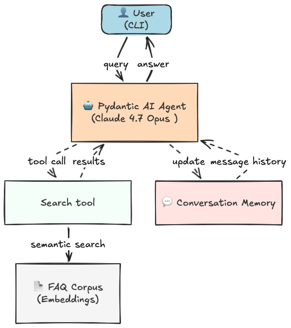

# /dev/color FAQ Agent

A command-line retrieval augmented generation (RAG) agent that answers questions about /dev/color using a FAQ knowledge base, with optional fallback to web search.

## Architecture



**Components:**
- *agent* — LLM (Claude Opus 4.7 via OpenRouter by default) with function calling
- *search_faq* — semantic similarity search via `sentence-transformers` embeddings (`all-MiniLM-L6-v2`)
- *web_search* — DuckDuckGo fallback for questions outside FAQ scope

**Project layout:**
```
devcolor-agent/
├── agent.py            # CLI loop, agent definition, tool wiring
├── index.py            # FAQ parser + semantic index
├── models.py           # Pydantic models (FAQEntry, SearchResult, ...)
├── tools.py            # Web search helper
├── data/
│   └── devcolorfaq.txt # FAQ corpus (one Q/A per entry)
├── requirements.txt
├── pyproject.toml      # uv / build config
└── .env.example
```

## Setup

Requires Python ≥ 3.10.

1. Install [uv](https://docs.astral.sh/uv/) if you haven't:
   ```bash
   curl -LsSf https://astral.sh/uv/install.sh | sh
   ```
2. From the project root, install dependencies:
   ```bash
   uv sync
   ```
3. Copy `.env.example` to `.env` and provide your OpenRouter key:
   ```bash
   cp .env.example .env
   # then edit .env and set OPENROUTER_API_KEY=...
   ```
   An OpenRouter API key is required. You may optionally override `MODEL`
   in `.env` to select a different model available on OpenRouter.
4. Run the agent:
   ```bash
   uv run agent.py
   uv run agent.py --verbose   # also show tool-call trace
   ```
   Type `exit` (or `quit`) to leave the chat.

> **Note:** On first run, `sentence-transformers` downloads the `all-MiniLM-L6-v2` model (~80 MB). Subsequent runs are instant.

## Example output

Run with the three required queries:

### 1. How can /dev/color help me develop my career?

```
/dev/color is designed to help Black technologists like you grow and advance
in tech. Here's how it can support your career development:

🌱 Community & Mentorship
 • Strong peer community: /dev/color fosters a supportive network of Black
   software engineers, founders, and leaders who help each other navigate
   challenges in the tech industry.
 • Mentorship programs: You can connect with mentors who can guide you
   through career decisions, skill-building, and leadership growth.

📈 Career Development Resources
 • Access to professional development sessions, workshops, and panels
   designed to help you advance—whether you're an engineer, aspiring
   manager, or founder.
 • Resources tailored to help Black technologists overcome systemic barriers
   and unlock new opportunities.

🤝 Industry Partnerships & Networking
 • /dev/color collaborates with organizations like the Black Product
   Managers Network, ColorStack, and Goodie Nation, expanding your access to
   communities across the tech ecosystem.
 • Partnerships with companies like Pinterest, Grammarly, and Concrete Rose
   Capital create networking events and direct connections to industry
   opportunities.

🎯 Long-Term Impact
By being part of /dev/color, you're not just developing your own
career—you're also helping advance diversity and equity in tech as part of a
broader movement.
```

### 2. How can I contribute to /dev/color?

```
There are several great ways you can contribute to /dev/color's mission of
empowering Black technologists:

👤 As an Individual
 • Make a financial contribution — Individual donations help sustain the
   organization's programs and community initiatives.
 • Participate in mentorship programs — Share your expertise by mentoring
   others, or get involved as a mentee to help grow the community.
 • Advocate for diversity in tech — Use your voice and platform to promote
   inclusion and equity in the tech industry.

🏢 As a Company
 • Sponsor events — Corporate sponsorships fuel panels, networking events,
   and professional development sessions.
 • Provide funding — Corporate partners contributed roughly $1.74 million in
   2023, making them the largest source of support for /dev/color's work.
 • Offer professional development opportunities — Companies can directly
   invest in Black technologists by providing workshops, training, or career
   programs.

💡 Why It Matters
Every contribution—big or small—helps /dev/color create a more inclusive and
equitable tech industry, supporting Black software engineers, founders, and
leaders along the way.
```

### 3. In which cities is /dev/color located?

```
Based on the FAQ, /dev/color has hosted in-person events in these major
cities:

 • 🌉 San Francisco
 • 🗽 New York
 • 🍑 Atlanta
 • 🌲 Seattle

These events were supported by corporate partners like LinkedIn and Intuit,
providing in-person opportunities for Black technologists to connect, learn,
and grow.

The FAQ specifically mentions these as event locations rather than office
locations.
```
